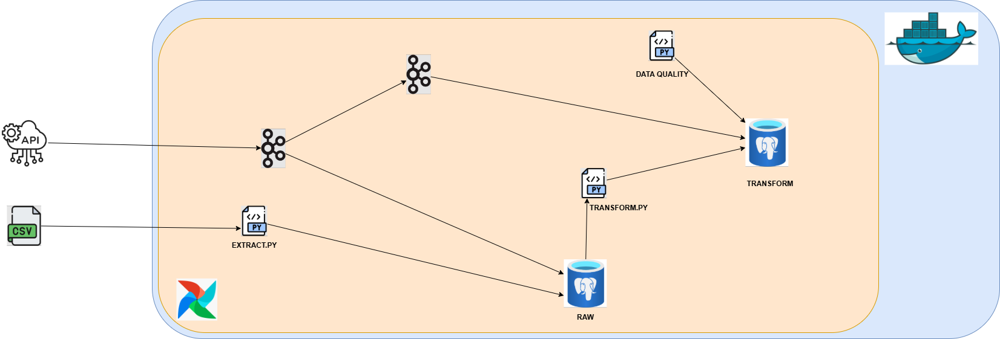

# Pipeline de données des Transactions frauduleuses

Prédire l’**Transactions frauduleuses**

| Couche                    | Technologie     | Fonctionnalité principale                                      |
| ------------------------- | --------------- | -------------------------------------------------------------- |
| **Données & Jobs**        | **Airflow 2.9** | Orchestration quotidienne des pipelines                        |
| **Stockage & Traîtement** | **Kafka**       | Stockage & Traîtement des données                              |
| **Enregistrement**        | **PostgreSQL**  | Base de donneés pour "Airflow" et "Fraud", stockés les fraudes |
| **Virtualisation**        | **Docker**      | Virtualisation                                                 |

---

## 1 · Sources de données :

- **FraudTEST.csv** : [https://lead-program-assets.s3.eu-west-3.amazonaws.com/M05-Projects/fraudTest.csv](https://lead-program-assets.s3.eu-west-3.amazonaws.com/M05-Projects/fraudTest.csv)
- **Fraud Detection API** : [https://huggingface.co/spaces/charlestng/real-time-fraud-detection](https://huggingface.co/spaces/charlestng/real-time-fraud-detection)

---

## 2 · Démarrage rapide :

```bash
# Construire :et
docker compose build --no-cache

# Lancer l’ensemble des services :
docker compose up -d
```

## 3 · Accéder aux interfaces :

- **Airflow (admin / admin)** : [http://localhost:8080](http://localhost:8080)

- **PostgreSQL** :

```bash
docker exec -it fraud_postgres psql -U postgres -d fraud
```

- **Kafka-CLI** :

```bash
kafka-console-consumer.sh \
  --bootstrap-server kafka:9092 \
  --topic nom_du_topic \
  --from-beginning
```

---

## 4 · Variables d’environnement clés :

Voir la liste complète dans `.env`.

---

## 5 · Schéma de la pipeline :



---

## 6 · DAGs Airflow par ordre chronologique :

| ID du DAG            | Programmation              | Description                                                          |
| -------------------- | -------------------------- | -------------------------------------------------------------------- |
| `dag_1`              | `@once`                    | extraction + stockage et transformation pour les données historiques |
| `dag_2`              | `@hourly` ou personnalisée | extraction + stockage et transformation pour les nouvelles données   |
| `dag_3_data_quality` | `@daily` ou personnalisée  | data_quality                                                         |

## 7 · Contenu de la pipeline :

1. Création des tables dans Postgresql.
2. Charger les données historiques de "fraudTest.csv" dans la table 1.
3. Transformer les données historiques et les charger dans la table 2.
4. Extraire les données actuelles à partir de l'API.
5. Charger les données actuelles dans la table 1.
6. Transformer les données actuelles et les charger dans la table 2.
7. Vérifier la qualité des données dans la table 2 périodiquement.

## 8 · Feuille de route

- À venir : ajout d’un tableau de bord pour la visualisation temps réel avec Grafana de la santé du système.

---

### Licence

MIT — utilisation, modification et partage libres. Contributions bienvenues !


